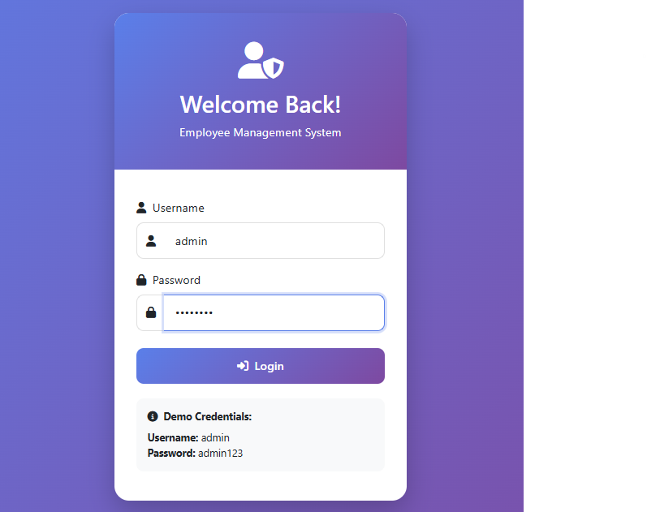
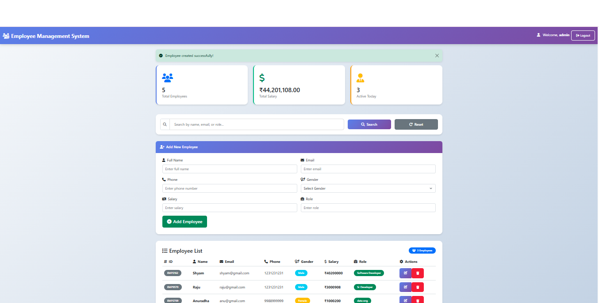

# 💼 Employee Management System

A modern, secure, and feature-rich Employee Management System built with Spring Boot, Thymeleaf, and MongoDB.
Manage employee records efficiently with role-based access control, advanced search, and an intuitive UI.

# 📋 Table of Contents

Features

Screenshots

Technology Stack

Prerequisites

Installation & Setup

Usage

API Endpoints

Security

Project Structure

Docker Deployment

Author

# ✨ Features

✅ CRUD Operations – Create, Read, Update, Delete employees

✅ Advanced Search – Filter by name, email, or role

✅ Role-Based Access – Admin & User permissions

✅ Dashboard Analytics – Employee stats & salary overview

✅ Input Validation & Unique Email Constraint

# 🔒 Security

 Spring Security with BCrypt password hashing

 CSRF protection & secure session management
 
 Admin-only access to sensitive operations

# 🎨 UI/UX

 Modern gradient design & responsive layout
 
 Smooth animations, Font Awesome icons, and alert notifications
 
 Intuitive navigation for all users

# 📸 Screenshots

Login Page: Secure authentication

Dashboard: Employee management & analytics

# 🛠 Technology Stack

Backend: Spring Boot, Spring Security, MongoDB, Thymeleaf, Bean Validation

Frontend: Bootstrap, Font Awesome, Custom CSS, JavaScript

Database: MongoDB

Build & Deployment: Maven, Docker, Docker Compose

📋 Prerequisites

- JDK 17+

-Maven 3.6+

-MongoDB 7.0+ (or Docker)

-Git

# 🚀 Installation & Setup

git clone https://github.com/yourusername/employee-management-system.git

cd employee-management-system

Start MongoDB (Docker or local):

docker run -d -p 27017:27017 --name mongodb mongo:7.0

Build & Run:

./mvnw clean install

./mvnw spring-boot:run

Access:
👉 http://localhost:8080

🐳 Docker Setup

docker-compose up --build

Access: http://localhost:8080

To stop:

docker-compose down

# 👥 Usage
Default Credentials

Role	Username	Password	Access

Admin	admin	admin123	Full CRUD

User	user	user123	Read-only

Admin Features: Add, Search, Update, Delete employees; View stats

User Features: View & search employees; Access dashboard only

#🔌 API Endpoints
Method	Endpoint	Access

GET	/	Authenticated

POST	/login	Public

POST	/logout	Authenticated

POST	/create	Admin

POST	/update	Admin

POST	/remove	Admin

GET	/?search={keyword}	Authenticated

# 🔐 Security

Authentication via Spring Security & BCrypt

Admin: Full CRUD, User: Read-only

CSRF, XSS protection, and input validation enabled

# 📁 Project Structure
employee-management-system/
├── src/main/java/com/ems/
│   ├── config/ SecurityConfig.java
│   ├── controller/ EmployeeController.java, AuthController.java
│   ├── service/ EmployeeService.java
│   ├── pojo/ Employee.java, ConfirmationForm.java
│   ├── repo/ EmployeeRepo.java
│   └── EmployeeManagementSystemApplication.java
├── src/main/resources/templates/
│   ├── index.html
│   ├── update.html
│   └── login.html
├── application.properties
├── Dockerfile
├── docker-compose.yml
├── pom.xml
└── README.md

# 🐋 Docker Deployment
docker build -t employee-management-system .

docker run -p 8080:8080 employee-management-system

Cloud Deployment: Render, Railway, or Heroku

Set environment variable:

MONGODB_URI=mongodb+srv://<username>:<password>@cluster.mongodb.net/ems

# 🤝 Contributing

Fork the repository

Create a feature branch

Commit changes

Push and open a Pull Request

# 👨‍💻 Author

Ruturaj Pawar

📦 GitHub: @Ruturaj-007

💼 LinkedIn: https://www.linkedin.com/in/ruturaj-pawar-4b84a6277/

✉️ Email: pruturaj3003@gmail.com

